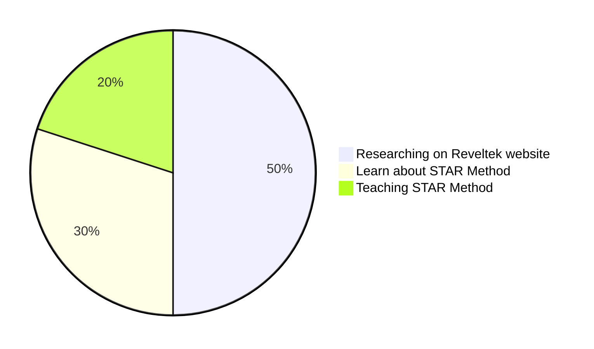

# Summary

Today, I hosted a session on Facebook and WhatsApp to teach others about "STAR" and worked on a task assigned by boss to remove corporate personnel names from GitHub and upload 200 files. I also instructed my team to work on the Reveltek website and start adding comments on completed issues.

---

Today my focus on managing the team and improving communication skill and learning opportunities within the team. The tasks include hosting sessions about Reveltek website, discussing the project management process, giving training on the STAR method and Smart commit, adding members to the channel for better communication, and assigning team members to shadow experienced team members in order to learn and improve their skills. The goal is to complete milestones in an efficient manner.

---

**SMART STAR** 

**Space**

Hey, everyone today is end of the week and since few days ago company owner give me premotion and he assign me as Project manager and he said to pic the any task so you can work on it so I pic Reveltek website so and I told him I will work on this project. Then I talk to my team and I tell them to work on the project and today I host session and we talk about this project and I teach new people how to create smart commit on GitHub and we research on the company like Mckinsey and we see top 10, tech consulting company's and we research on AI company's, because Reveltek is tech company also we are an AI company and we build so many robots and we are consultant agency so we research accordingly and my next task was to teach RDP and KVM and I teach RDP and I also give STAR training on Facebook and WhatsApp.

**Track** 

The plan I came for today was to communicate on the Reveltek project and let new people know about the Reveltek company like which kind of Reveltek company is so that's why I created a meeting and in the 3:00 hours of meeting we talk about what Reveltek is and we research which kind of company's we can see who work like Reveltek so that's why we research and we search top 10 tech company's and we focus on character count and we did MVP, and I teach new people about Outlook like how to check Calendar and how to flag emails and I also quiz people on our Essential Training Guide.

**Assist:**

In Assist, we discuss how we can work on this project, so I tell them we are going to work on milestones. There were 10 issues open, so we started on those. We went through those issues and saw which ones were completed, so we started adding comments and creating pull requests. We also went through the files that were already uploaded to the repository and got some ideas for the navigation bar. I guess and teach new users how to use LinkedIn, such as how to respond to people on LinkedIn. I also teach them how to recover if they delete an email.

**Reach**

In Reach finally we research for navigation bar and we all communicate on that issue and we see that is character count same but character count was not matching so we use Open AI and we find alternative words like by using chat.GPT we get word like Agile organization to Agile org and we did our best in this project and after we get perfect character count we create smart commit and to day I join meeting with company owner and we learn about new STAR method and we also learn about how to create mermaid file and I just learn it and I make an impact on company by implementing on my SMART STAR.

---

**SMART STAR:**

**Space:**
 
- Hi, everyone! Today, I'm going to manage my team on the Reveltek website. We will work on milestones and make smart commits. Additionally, I will research how to       manage projects, since I have not done so before. I will save my notes in a Markdown file.
 
**Track:**
 
- I will start by managing the team on the Realtek website. This includes assigning tasks, providing feedback, and setting deadlines. After that, I will work on         milestone completion and do smart commits. After that, I will research project management and save my notes in a Markdown file. Lastly, I will provide training to my   team on how to do smart commits on GitHub.
 
**Assist:**
 
- In addition to coordinating on GitHub comments and using the Teams app, I will do research about project by looking at websites like Apple and McKinsey. This will     help to understand the best practices for project management and how to utilize advanced tools and techniques. Additionally, I will use the Teams app to stay           organized and monitor the progress of tasks.
 
**Reach:** 
 
- By following the steps outlined in the project management roadmap, I will be able to ensure that the project is completed on time and with high quality.               Additionally, my team and I will be able to deliver innovative solutions, utilize advanced tools and techniques, and provide a user-friendly experience. 

---

Space: Today our company host tits bit Tuesday meeting and the agenda of that meeting how to become a better thief and the title meaning is Thief in training so we research on how we can become better thief.

Track: Thief in training meeting we learn about history learn history about Thomas Addison and Nikola Tesla and Right brother and Grimm brother’s history and also we read history of Disney how these people become successful in their life. 

Assist: In the assist part research we see how Thomas Addison steal idea of Nikola Tesla, and how Disney steal information from Grimm brothers and how Right brother steal idea of Indian guy and how they implement those ideas in their life, and become senseful.

Reach: In the reach I just understand Nikola Tesla and the Indian guy who did all effort for helicopter and Grimm brothers they all are not successful people but the successful people was is Thomas Addison and Disney and Right brothers they are real thief and they are successful people.

---

SMART STAR:

Space: Today, we're going to work on the Reveltek website Reveltek is a tech consulting website and AI company, and we dream we want to build a company like a big company, but we will take small steps and then the team will start working on it our inspiration is IBM and Mckinsey, our competitions is with this kind of company.

Track: The project roadmap is to work on the Reveltek website, which is a tech consulting and AI company. The goal is to build a company like IBM and McKinsey but taking small steps. The team will start working on the website today, and the competition is with similar companies. It is important to track progress and adjust the plan as needed to reach the goals.

Assist: Today, I will be managing my team on the Reveltek website project. Our focus will be on achieving our milestones, and we will be using smart commits to track our progress. Additionally, we will be conducting research to inform our work on the project.

Reach: The company Reveltek believes that their method can make them one of the top companies in the world. Their confidence is since they use the same method as the top 10 best companies in the world, implying that this method has been proven successful. Despite being a small company, Reveltek hopes to achieve great success by following this tried-and-tested method.
p

---

## Summary

Thursday-16-2023

I have spent a significant amount of time teaching others how to effectively use Figma, a design tool utilized for creating various graphic designs, including user interfaces and icons.

Furthermore, I have gained valuable experience through my work on DROIDS, where I recently created a map and learned how to efficiently resize photos. During a Thursday Thivery meeting, I created a detailed agenda on DROIDS and actively sought feedback and suggestions from my colleagues, resulting in a collaborative effort to improve our work.

- I Created milestones on GitHub: What I'm going to do in future I created 6 milestones.

---

This process outlines the steps necessary for the company to effectively rehire current employees in order to provide them with additional training and skills to help the organization grow. It includes reviewing applications, making job offers, coaching new hires, teaching them the necessary knowledge, monitoring their progress and development, adjusting training programs as needed, and evaluating and revising the training. By following these steps, the company can ensure that its current employees have the opportunity to gain the skills and knowledge they need to succeed.
