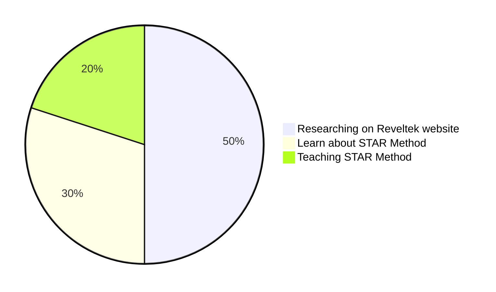

# Summary

Today, I hosted a session on Facebook and WhatsApp to teach others about "STAR" and worked on a task assigned by boss to remove corporate personnel names from GitHub and upload 200 files. I also instructed my team to work on the Reveltek website and start adding comments on completed issues.

---

Today my focus on managing the team and improving communication skill and learning opportunities within the team. The tasks include hosting sessions about Reveltek website, discussing the project management process, giving training on the STAR method and Smart commit, adding members to the channel for better communication, and assigning team members to shadow experienced team members in order to learn and improve their skills. The goal is to complete milestones in an efficient manner.

---

**SMART STAR** 

**Space:**

Hey, everyone today is end of the week and since few days ago company owner give me premotion and he assign me as Project manager and he said to pic the any task so you can work on it so I pic Reveltek website so and I told him I will work on this project. Then I talk to my team and I tell them to work on the project and today I host session and we talk about this project and I teach new people how to create smart commit on GitHub and we research on the company like Mckinsey and we see top 10, tech consulting company's and we research on AI company's, because Reveltek is tech company also we are an AI company and we build so many robots and we are consultant agency so we research accordingly and my next task was to teach RDP and KVM and I teach RDP and I also give STAR training on Facebook and WhatsApp.

**Track** 

The plan I came for today was to communicate on the Reveltek project and let new people know about the Reveltek company like which kind of Reveltek company is so that's why I created a meeting and in the 3:00 hours of meeting we talk about what Reveltek is and we research which kind of company's we can see who work like Reveltek so that's why we research and we search top 10 tech company's and we focus on character count and we did MVP, and I teach new people about Outlook like how to check Calendar and how to flag emails and I also quiz people on our Essential Training Guide.

**Assist:**

In Assist, we discuss how we can work on this project, so I tell them we are going to work on milestones. There were 10 issues open, so we started on those. We went through those issues and saw which ones were completed, so we started adding comments and creating pull requests. We also went through the files that were already uploaded to the repository and got some ideas for the navigation bar. I guess and teach new users how to use LinkedIn, such as how to respond to people on LinkedIn. I also teach them how to recover if they delete an email.

**Reach**

In Reach finally we research for navigation bar and we all communicate on that issue and we see that is character count same but character count was not matching so we use Open AI and we find alternative words like by using chat.GPT we get word like Agile organization to Agile org and we did our best in this project and after we get perfect character count we create smart commit and to day I join meeting with company owner and we learn about new STAR method and we also learn about how to create mermaid file and I just learn it and I make an impact on company by implementing on my SMART STAR.

